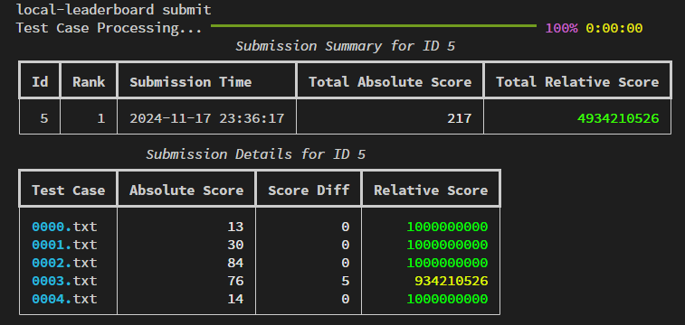
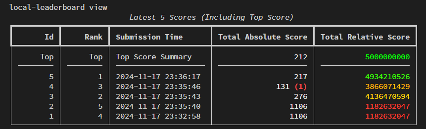
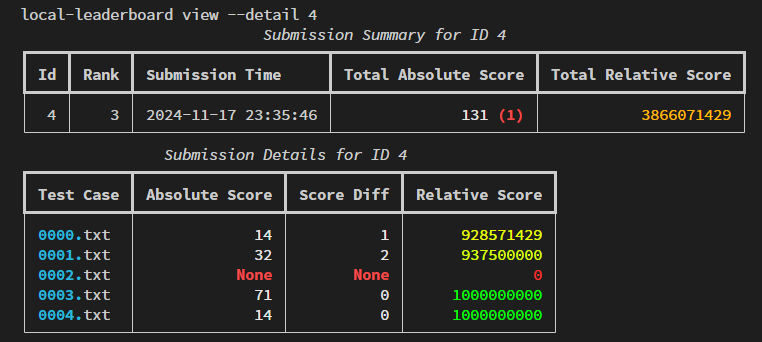
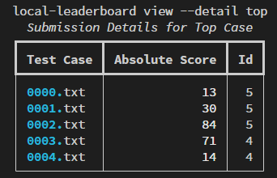

# ahc-local-leaderboard
[](https://opensource.org/licenses/MIT) [](https://github.com/Bolero-fk/ahc-local-leaderboard/actions)  [](https://www.python.org/downloads/release/python-3100/)

`ahc-local-leaderboard`はAtCoderのAHC（AtCoder Heuristic Contest）で使用するツールです。  
自分の提出スコアを元に、相対順位表をローカル環境で作成・管理できます。

## Requirements

- **Python 3.8以上**がインストールされていること
- **AHC公式ツール**（各コンテストで提供されるローカル版の入力ジェネレータ・ビジュアライザツール）が必要です
- **Rust言語のコンパイル環境**が必要です（点数計算のためにビジュアライザツールを実行します）

`ahc-local-leaderboard`は、AHCの公式ツールが展開されたディレクトリ内の`tools`ディレクトリで実行することを想定しています。

> **注記**: Rustのインストール方法については[Rust公式サイト](https://www.rust-lang.org/ja/tools/install)や、AHC公式ツールのREADMEを参照してください。

## How to Install

以下のコマンドを実行してください：
```bash
pip install git+https://github.com/Bolero-fk/ahc-local-leaderboard.git
```

## Usage
### setup
1. AHC公式ツール内の`tools`ディレクトリに移動します。
2. 以下のコマンドを実行して、相対順位表用のディレクトリを作成します：
```bash
local-leaderboard setup
```
この手順により`ahc-local-leaderboard`で必要となるファイルやディレクトリが準備されます。

**セットアップ時にスコアの計算方法を尋ねられた場合：**

- 相対評価スコアの計算方法が $` \mathrm{round}(10^9 \times \frac{自身のスコア}{全参加者の最高スコア}) `$ の場合は、`1: Maximization`を選択してください。
- 相対評価スコアの計算方法が $` \mathrm{round}(10^9 \times \frac{全参加者の最小スコア}{自身のスコア}) `$ の場合は、`2: Minimization`を選択してください。

> **注記**: **計算式の詳細な表記**（例:「全参加者の最小スコア」と「全参加者の最小絶対スコア」など）はコンテストごとに異なる可能性がありますが、上記の2つの計算方法に対応しています。  
**一方、計算式の構造自体が全く異なる場合**（例：[AHC025](https://atcoder.jp/contests/ahc025/tasks/ahc025_a)の$`\mathrm{round}(10^9\times (1-\frac{r}{n}))`$）には対応していません。

### submit
`submit`コマンドを使うことで、自分の提出結果をローカル順位表に登録できます。
```bash
local-leaderboard submit
```

このコマンドでは、以下の処理が行われます：
- **入力と出力のファイル**  
  -`in`ディレクトリのファイルを入力として使用。
  -`out`ディレクトリのファイルを出力として使用。  
  
  ※ **ファイル名は一致させる必要があります**。例えば、`in/0000.txt`に対応する出力ファイルは`out/0000.txt`である必要があります。

- **点数計算**  
  AHCツールに含まれるビジュアライザを使用してスコアを計算。

提出処理が終了すると、以下のように提出結果が表示されます：

<div align="center">

</div>


詳しい見方については、[view](#view)のセクションを参考にしてください。

#### submit option (--pahcer-directory 🧪β機能)
`submit`コマンドを以下のように使用すると、[pahcer](https://github.com/terry-u16/pahcer)によって出力されるファイルを用いて点数計算ができます：
```bash
local-leaderboard submit --pahcer-directory <path>
```
指定したディレクトリ内の`pahcer/json/xxx.json` にある JSON ファイルのうち、**最も新しい更新時間のもの** が点数計算に使用されます。

#### submit option (--skip-duplicate 🧪β機能)
`submit`コマンドを以下のように使用すると、すでに同じ絶対点数の提出がデータベース内に存在する場合、提出処理をスキップします：
```bash
local-leaderboard submit --skip-duplicate
```

### view
`view`コマンドを使うことで、過去の提出結果を表示できます。
```bash
local-leaderboard view
```

以下は実行結果の例です：
<div align="center">

</div>

| 項目名 | 説明|
|:-:|-|
| **Id**| 各提出に割り振られた一意の識別番号です。|
|**Rank**|相対スコアに基づく順位を表します。|
|**Submission Time**|提出の日時を表します。|
|**Total Absolute Score**|提出全体の絶対スコアの合計値です。<br>（括弧内の数字は、点数計算が失敗したテストケースの総数を表します）|
|**Total Relative Score**|提出全体の相対スコアの合計値です（最も高いスコアが$`10^9`$になります）。|

---
#### view option (--details \<id\>, latest)
`view`コマンドを以下のように使用すると、特定の提出結果や最新の提出結果を詳細表示できます：
```bash
local-leaderboard view --detail <id>
```
もしくは
```bash
local-leaderboard view --detail latest
```

以下は実行結果の例です：
<div align="center">

</div>


- **概略**\
  上部は概略を表しています。

- **詳細結果**\
  下部は詳細を表しています。各テストケースのスコアや相対スコアの情報が表示されます。以下はその詳細結果の見方です：

| 項目名| 説明|
| :-: | - |
| **Test Case**|テストケースの名前です。|
|**Absolute Score**|各テストケースの絶対スコアです。<br>Noneになっているテストケースは点数計算が失敗したことを表しています。|
|**Score Diff**|現在のトップスコアとの差分を表します。<br>Noneになっているテストケースは点数計算が失敗したことを表しています。|
|**Relative Score**|各テストケースの相対スコアです（最も高いスコアが$`10^9`$となります）。|

---
#### view option (--details top)
`view`コマンドを以下のように使用すると、現在のトップスコアの各テストケースごとの詳細が表示されます。

```bash
local-leaderboard view --detail top
```

以下は実行結果の例です：
<div align="center">

</div>

| 項目名| 説明|
| :-: | - |
| **Test Case**|テストケースの名前です。|
|**Absolute Score**|各テストケースの絶対スコアです。|
|**Id**|このスコアが取得された提出IDを表します。|


## License
このプロジェクトはMITライセンスの下で公開されています。詳細は[LICENSE](./LICENSE)ファイルをご覧ください。
